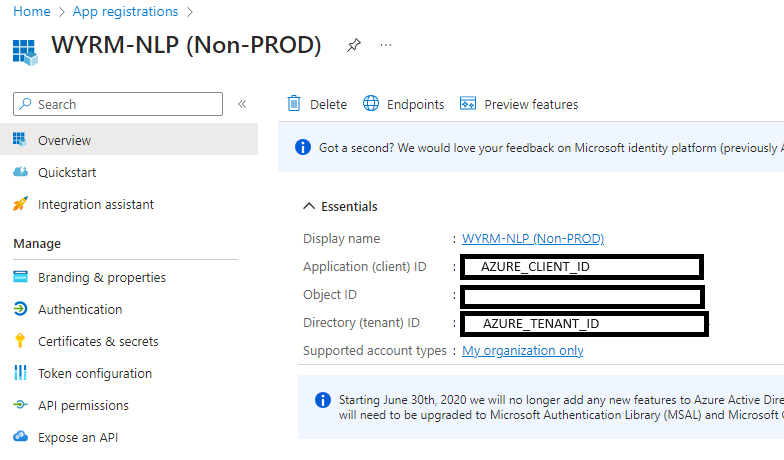
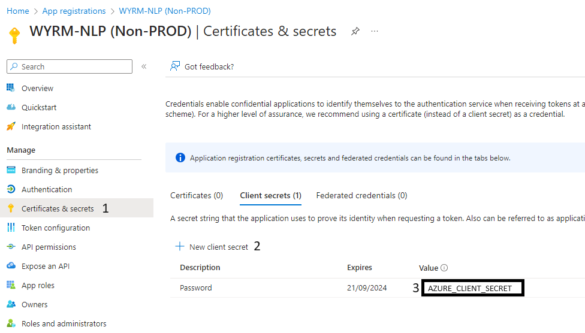
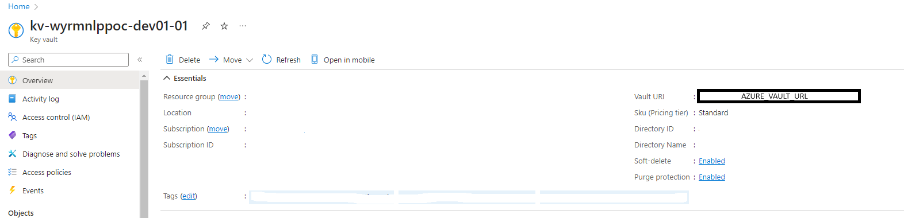

# Wyrm RAG

Wyrm RAG (retrieval-augmented generation) is a Python-based project aimed at implementing a Large Language Model SQL agent for a public enterprise. This agent serves to translate natural language questions into SQL queries to be executed in their database, and then re-translate the answer for the user.

## Features

- **Natural Language Processing (NLP)**: Utilizes NLP techniques to understand and interpret natural language queries.
- **SQL Query Generation**: Transforms natural language queries into SQL queries.
- **Database Interaction**: Executes SQL queries on the enterprise database.
- **Response Translation**: Translates query results back into natural language for user comprehension.

### Prerequisites

- Python 3.10 or higher
- Azure components:
    - **Service principal** registered on Azure Active Directory. When you register your application you're creating an identity configuration for your application that allows it to integrate with Azure components.
- Azure services:
    - **Resource group** to host all the Azure resources.
    - **OpenAI** service created and **gpt-35-turbo** model deployed.
    - **Azure Key Vault** created to store OpenAI-api-version, OpenAI-endpoint and OpenAI-api-token.
- Azure rights and permissions:
    - The user in charge to configure and interconnect the azure components and services must have:
        - Visibility on the **Service principal** created.
        - Admin rights on **Azure Key Vault** to add a *Key Vault Secrets User* role to the **Service principal**.
        - Rights to create an **Azure OpenAI service**.
        - Rights and quota to deploy the **gpt-35-turbo** model.


### Instructions

1. Clone the repository:

    ```bash
    git clone https://git.epo.org/wyrm/WYRM-NLP.git
    ```

2. Navigate to the project directory:

    ```bash
    cd WYRM-NLP
    ```

3. Create a virtual environemnt and activate

    ```bash
    python -m venv [venv_name]
    source {venv_name}/bin/activate
    ```

> [!NOTE]
> You can virtual environment be called .venv for instance.
> The command to activate the virtual environment varies depending on
> the operative system you are using. The suggested command works for **Linux** which is the base system for EPyQUE
> However, if your workspace is based on **Windows**, you should run:
> ``` {venv_name}/Scripts/activate ```

## Installation

1. Ensure the project dependencies are installed by running:

    ```bash
    pip install -r requirements.txt

    ```
2. Create an environment file named .env with the following environment variables:

    ```
    AZURE_CLIENT_ID=x
    AZURE_TENANT_ID=x
    AZURE_CLIENT_SECRET=x
    AZURE_VAULT_URL=x
    ```

    You can get the values of these environment variables:

    1. Go to Azure portal, in **App registrations** service you must see your Service Principal. You can get **AZURE_CLIENT_ID** and **AZURE_TENANT_ID** from Overview section.

    <div align="center">
    
    </div>

    2. In Certificates and Secrects sections you have to create a new client secret a get the token which will be the value for **AZURE_CLIENT_SECRET**.

    <div align="center">
    
    </div>

    3. To set **AZURE_VAULT_URL** value, we have to go to our **Key Vault** service where we'll find this URL.

    <div align="center">
    
    </div>


3. Connect to the interface using:

    ```bash
    streamlit run main.py

    ```

## Contributing

Contributions are welcome! If you'd like to contribute to the Wyrm RAG project, please follow these steps:

1. Fork the repository.
2. Create a new branch (`git checkout -b feature/my-feature`).
3. Make your changes.
4. Commit your changes (`git commit -am 'Add new feature'`).
5. Push to the branch (`git push origin feature/my-feature`).
6. Create a new Pull Request.


## Contact

Luiz Avelino Rodriuges - lavelinr@emeal.nttdata.com
Guillermo Carillo  - gromecar@emeal.nttdata.com